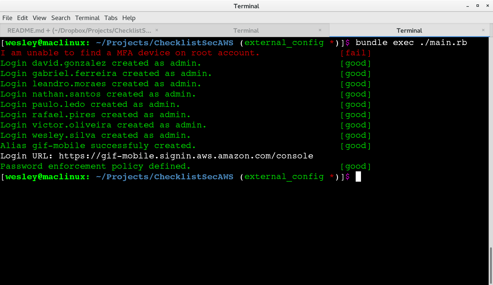
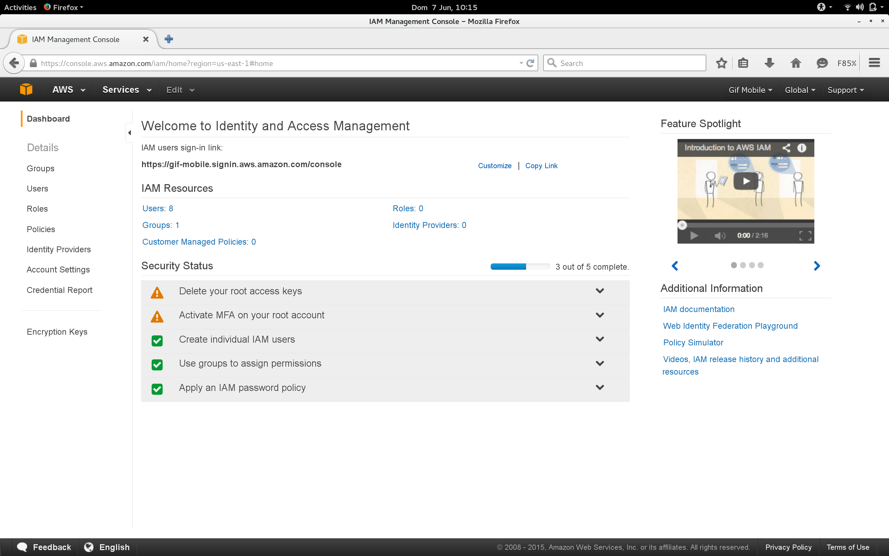
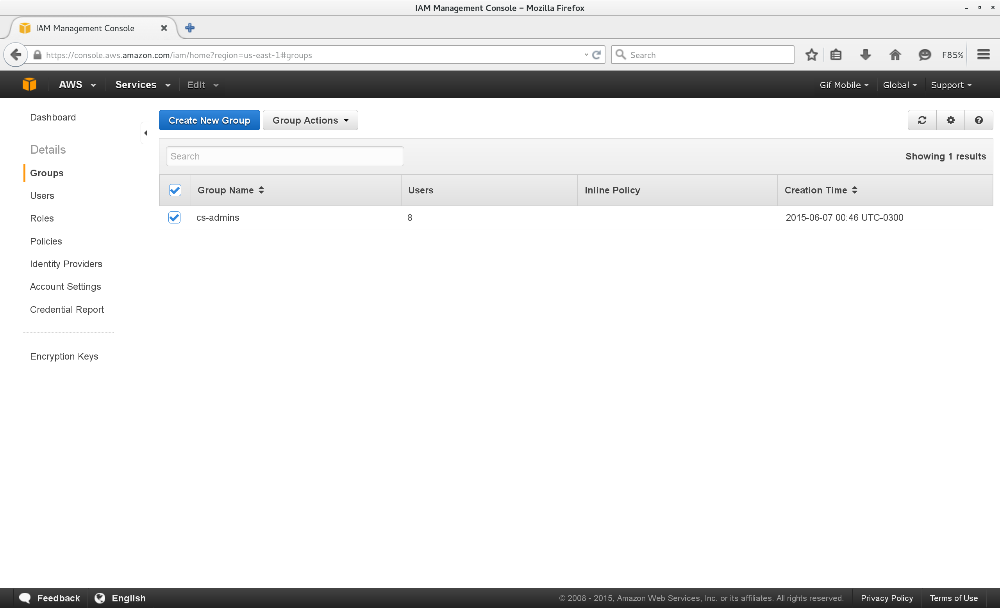
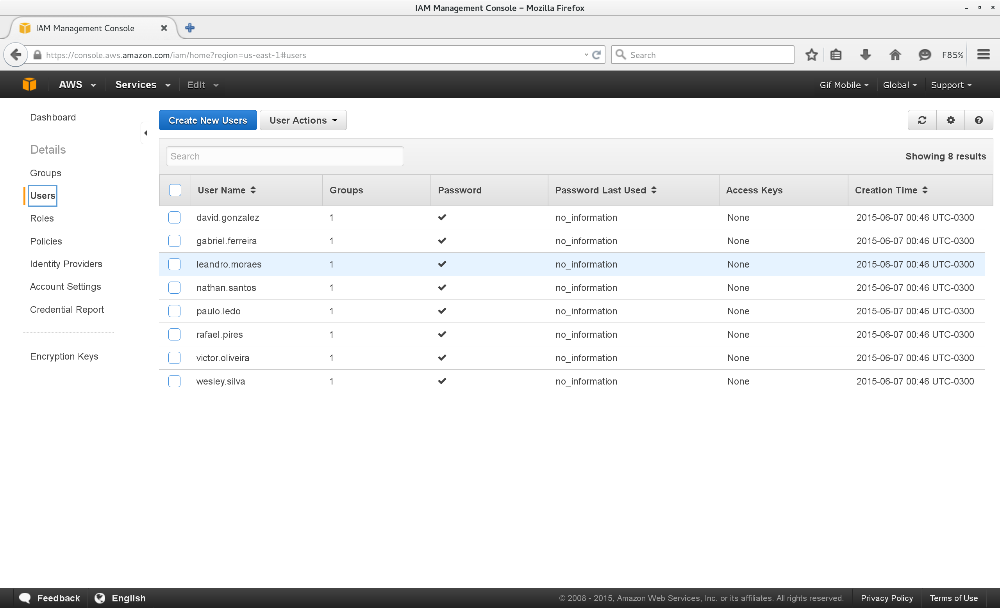
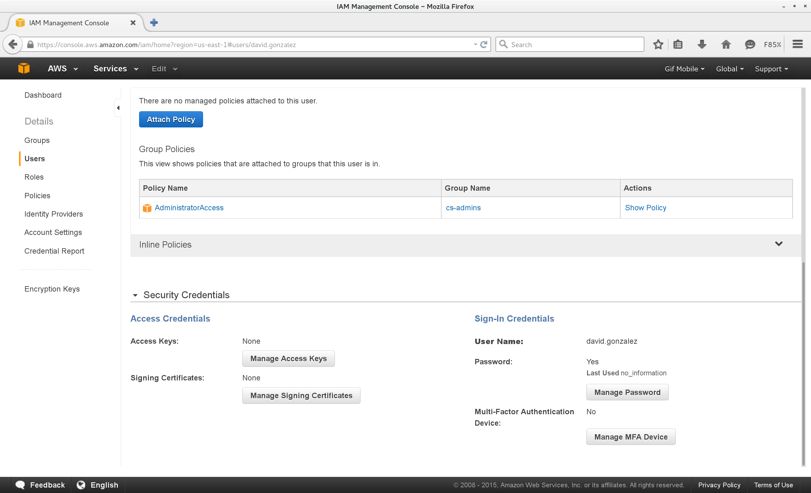
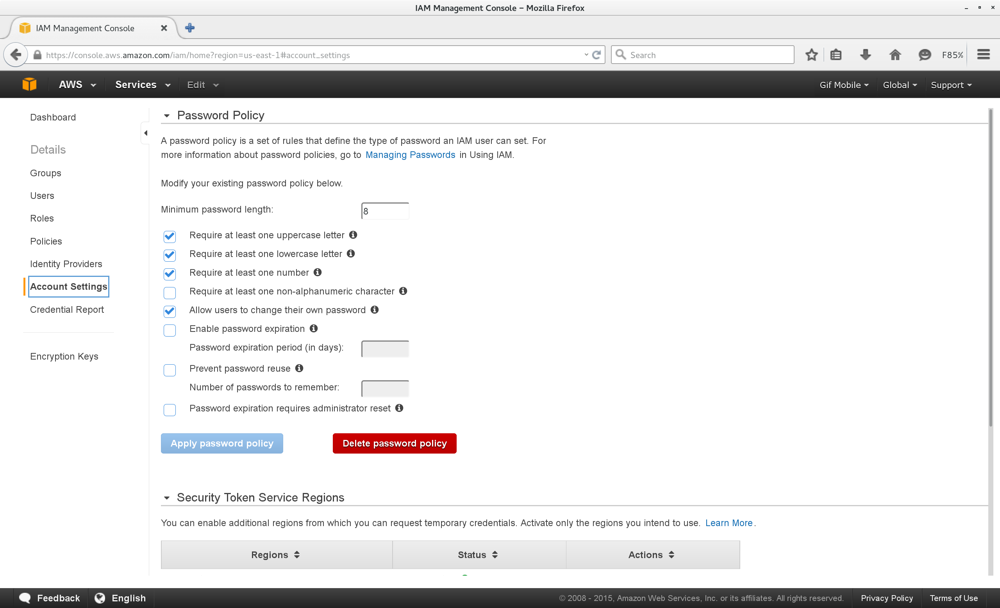

Checklist para projetos na AWS
==============================

Para as novas contas criadas na AWS, algumas boas práticas de segurança devem ser observadas e aplicadas quando necessário. Este script faz exatamente isto. Através da execução de alguns passos recomendados pela AWS, ele aumenta o nível de segurança da conta.

Requisitos
==========
O script foi testado em um sistema Linux com Ruby 2.1. Para ser mais exato, um OpenSuSE Tumbleweed x86_64.
É necessário ter o Rubygems e o Bundler para baixar as dependências.

Como utilizar
=============
1 - Clone o repositório em algum diretório da sua máquina:

`git clone https://cs_wesleysilva@bitbucket.org/cs_wesleysilva/checklistsecaws.git`

`cd ChecklistSecAWS`

2 - Crie um arquivo config.yml. Você pode copiar o arquivo de exemplo para ter por onde começar.
Lembre-se de inserir a Acess Key, a Secret Acess Key e o nome do alias desejado para a conta:

`cp config.yml.sample config.yml`

`vim config.yml`

3 - Rodar o Bundle Install para baixar as dependências do ruby:

`bundle install`

4 - Executar o programa usando o bundle:

`bundle exec ./main.rb`

Você deve ver algo parecido com isto na execução do script:

5 - Por enquanto, ainda é necessário colocar o MFA, ativar o CloudTrail e remover a Key e Secret Key da conta master manualmente. **Por enquanto.** 

Resultados
==========
Alias criado no signin IAM:
---------------------------

Grupo cs-admins criado:
-----------------------

Usuários criados e com senhas definidas. 
----------------------------------------
A senha será Concrete2015, e será solicitada a alteração no primeiro login:

Usuários adicionados ao grupo com Policy de Admin aplicada:
-----------------------------------------------------------

Políticas de senhas aplicada:
-----------------------------

Melhorias
=========

 - O script ainda não resolve o problema do CloudTrail. Tive problemas (de tempo apertado) para terminar.
 - Ele não seleciona automaticamente o nome do Alias IAM da conta. O ideal seria se ele pegasse o e-mail da conta root e automaticamente fizesse propostas de nomes.
 - Ele não é idempotente. Inicialmente pensei em usar Ansible/Chef/Puppet mas eles não suportam tantas alterações assim no IAM, só a API com SDK nativa suportava tudo que precisava ser feito. Por isso ele deve ser executado no início da criação da conta.

 **Red > Green > Refactor, sempre!**

